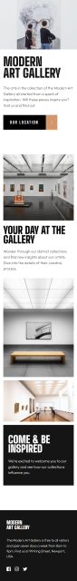
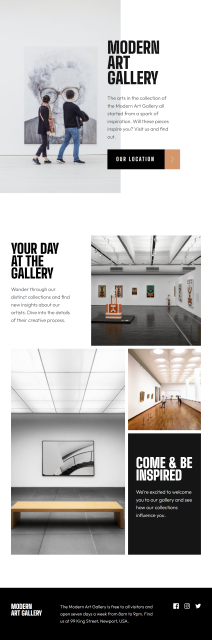
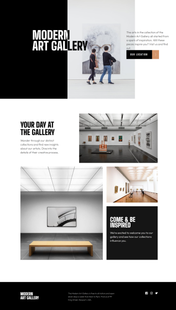

## Jump To

- [Screenshots](#screenshots)
- [Links](#links)
- [Notes](#notes)
  - [Built with](#built-with)
- [Author](#author)

### Screenshots

### Links

- GitHub Repo: [Go to Repository](https://github.com/gkhuskivadze/Art-Gallery-LandingPage-Markup)
- Live Demo: [Go to Demo](https://gkhuskivadze.github.io/Art-Gallery-LandingPage-Markup)

### Built with

- Semantic HTML5
- CSS Flexbox
- CSS GRID
- CSS Media Queries

### Notes

- Markup is made for three screen resolutions 375, 768px, 1440px.
- Fonts are linked from Google Fonts service.
- REM size is 10px and set to html using font-size property set by %.
- Mobile layout is built using CSS GRID module.
- For Tablet and Desktop layout I mixed CSS GRID & FLEXBOX.
- Element positioning is done by using several CSS properties like simple ones margin, padding, also using position, transform and flexbox capabilities.
- Instead of setting strict layout, I experimented with CSS FLEXBOXs flex and BACKGROUNDs position + %s to achieve increased responsiveness outside the three breakpoints.
- I got an interesting challenge to make the main title visually different, after trial and error I did it, which I feel gave me new look on markup possibilities.

## Author

- LinkedIn - [Giorgi Khuskivadze](https://www.linkedin.com/in/gkhuskivadze)
- GitHub - [Giorgi Khuskivadze](https://github.com/gkhuskivadze)
